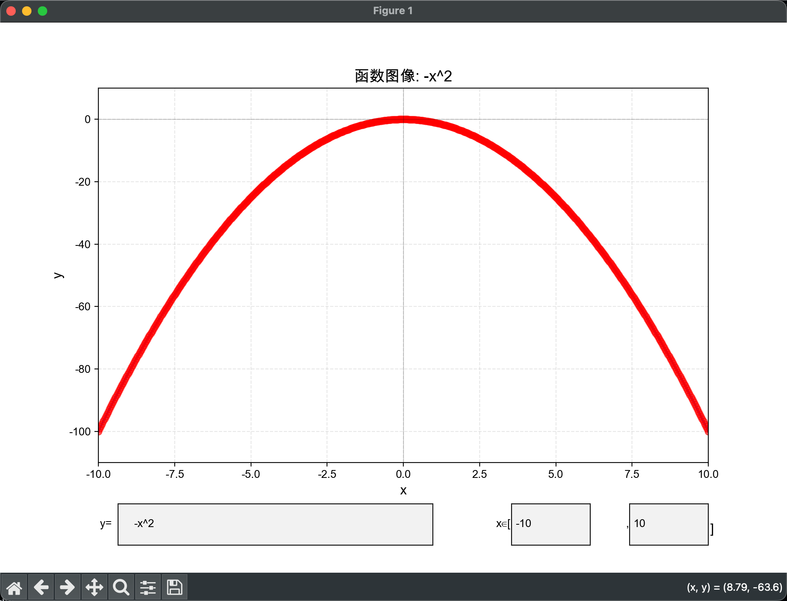
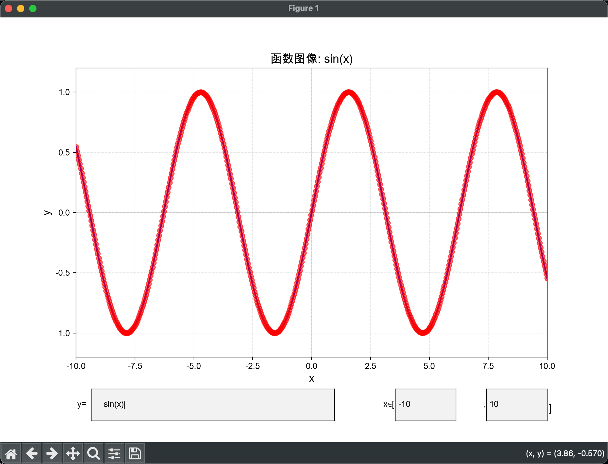
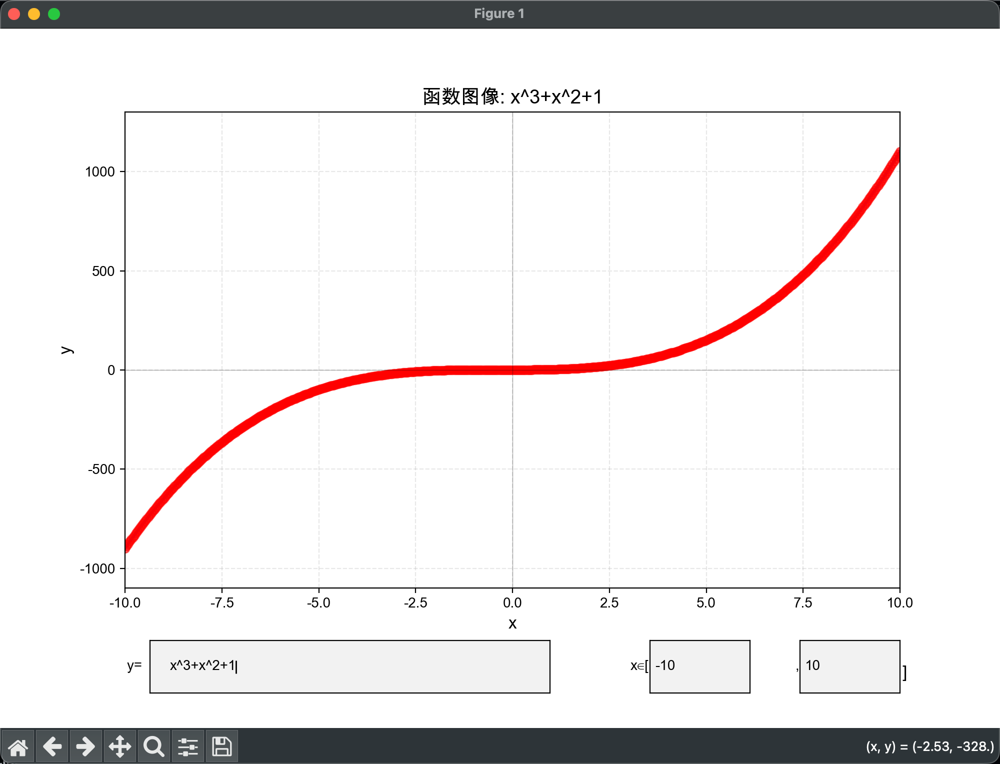
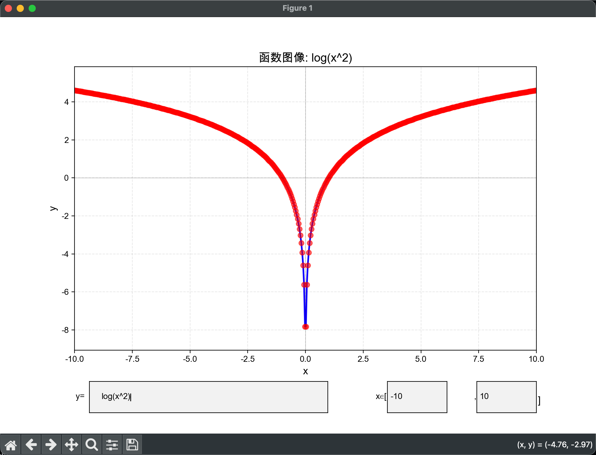

# py-xygraph - 数学函数图像绘制工具

一个数学函数可视化工具，支持实时 GUI 交互和命令行批量生成。专为数学教学和学习设计，帮助用户直观理解函数图像。


## ✨ 功能特点

*   **🖥️ 实时 GUI 交互界面**：
    *   提供图形化窗口，无需重启即可不断尝试新公式。
    *   **动态调整范围**：界面内置 X 轴范围输入框，可随意放大缩小观察区域。
    *   实时渲染：回车即绘图。
*   **🚀 命令行支持 (CLI)**：支持通过命令行参数直接生成图像或保存为文件。
*   **📐 智能公式解析**：
    *   支持隐式乘法（如 `2x`, `sin(x)cos(x)`）。
    *   支持常见数学函数（`sin`, `cos`, `sqrt`, `exp` 等）。
*   **🎨 高质量绘图**：
    *   默认 500 个采样点，曲线平滑无折角。
    *   自动适配中文字体（支持 macOS/Windows/Linux 常见字体）。

## �️ 效果展示

| $y=x^2$ (抛物线) | $y=\sin(x)$ (正弦曲线) |
| :---: | :---: |
|  |  |
| **$y=x^3$ (三次函数)** | **$y=\log(x)$ (对数函数)** |
|  |  |

## �🚀 快速开始

### 方式 1：一键启动（推荐）

我们也提供了跨平台的启动脚本，会自动检测 Python 环境、创建虚拟环境并安装依赖。

*   **macOS / Linux**:
    ```bash
    ./start.sh
    ```
*   **Windows**:
    双击 `start.bat` 文件。

### 方式 2：手动安装

如果你偏好手动管理环境：

1.  安装依赖：
    ```bash
    pip install -r deps.txt
    ```
2.  运行程序：
    ```bash
    python main.py
    ```

## 📖 使用指南

### 1. GUI 交互模式

直接运行程序进入交互模式：
```bash
python main.py
```
*   在底部 **"方程式 y="** 文本框输入公式（如 `x^2`, `sin(x)`），按回车绘制。
*   在右侧 **"x∈[ ... ]"** 输入框修改 X 轴范围（如 `-50` 到 `50`），按回车立即更新视图。

### 2. 命令行模式

支持直接通过参数生成图像，适合脚本调用或保存图片。

**基本用法：**
```bash
python main.py "y=x^2"
```

**高级选项：**
```bash
python main.py "y=sin(x)" --points 1000 --xmin -20 --xmax 20 --save my_plot.png
```

| 参数 | 说明 | 默认值 |
| :--- | :--- | :--- |
| `equation` | 要绘制的方程式 | 无 |
| `--points` | 采样点数量（点越多越平滑） | 500 |
| `--xmin` | X 轴最小值 | -10 |
| `--xmax` | X 轴最大值 | 10 |
| `--save` | 保存图像到的路径 | 不保存 |

## 🧮 支持的数学表达

支持标准 Python 数学语法及部分简化写法：

*   **基本运算**：`+`, `-`, `*`, `/`, `^` (或 `**`)
*   **三角函数**：`sin(x)`, `cos(x)`, `tan(x)`
*   **其他函数**：
    *   `sqrt(x)` - 平方根
    *   `abs(x)` - 绝对值
    *   `exp(x)` - 指数 $e^x$
    *   `log(x)` - 自然对数 $\ln(x)$
*   **常数**：`pi` ($\pi$), `e`

**输入示例：**
*   `y = x^2 + 2*x + 1`
*   `y = 2sin(x) + cos(2x)`
*   `y = sqrt(abs(x))`

## 📂 项目结构

```text
.
├── main.py       # 程序入口
├── core.py       # 核心逻辑（公式解析、计算、绘图引擎）
├── gui.py        # GUI 界面实现
├── start.sh      # Mac/Linux 启动脚本
├── start.bat     # Windows 启动脚本
└── deps.txt      # 项目依赖
```

## 📝 常见问题

**Q: 为什么画出来的正弦曲线像折线？**
A: 采样点太少。GUI 模式默认已设为 500 点。如果使用命令行，请增加 `--points` 参数，例如 `--points 1000`。

**Q: 中文显示为方框？**
A: 程序内置了 `SimHei`, `Arial Unicode MS`, `PingFang SC` 等多种字体回退机制，通常能自动覆盖主流操作系统。如果仍有问题，请检查系统是否安装了对应中文字体。